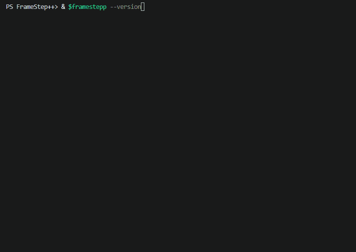

# FrameStep++

[](https://github.com/Rowrow620/Framestepp/actions/workflows/ci.yml)

FrameStep++ is a statically typed programming language built from scratch in
C++20. It checks source programs, compiles them into verified bytecode, and
executes them on a stack-based virtual machine.

## Demo



## Example

```framestepp
fn damage(base: Int, critical: Bool) -> Int {
    if critical {
        base * 2
    } else {
        base
    }
}

frameout(damage(35, true));
```

```text
70
```

## How it works

```text
Source -> Lexer -> Parser -> Type Checker -> Bytecode Compiler
       -> Bytecode Verifier -> Virtual Machine -> Output
```

The command-line interface can display tokens, syntax trees, verified bytecode,
diagnostics, and program output.

## Build and run

Requirements:

- CMake 3.25 or newer
- Ninja
- A C++20 compiler

```powershell
cmake --preset release
cmake --build --preset release --parallel
ctest --preset release

.\build\release\framestepp.exe run .\examples\boss_fight.frame
```

Linux users can run `./build/release/framestepp` instead.

## Verification

FrameStep++ includes 122 automated tests and is tested with MSVC, GCC, Clang,
AddressSanitizer, and UndefinedBehaviorSanitizer.

## License

MIT
